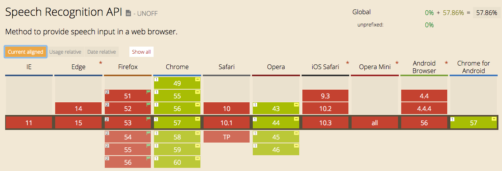
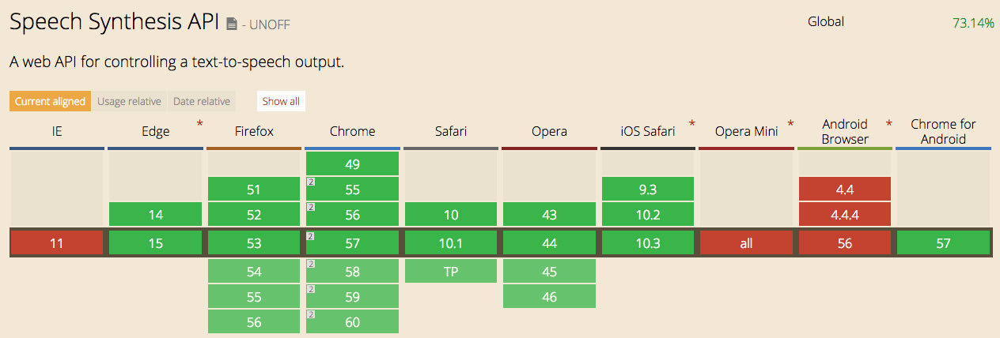

# web-speech-api-demo
## usage
```
# install the dependencies
$ npm install
# run the server on localhost:3000
$ node server.js
```
## Browser support (2017/4/24)
### chrome is recommended 
</img>
</img>